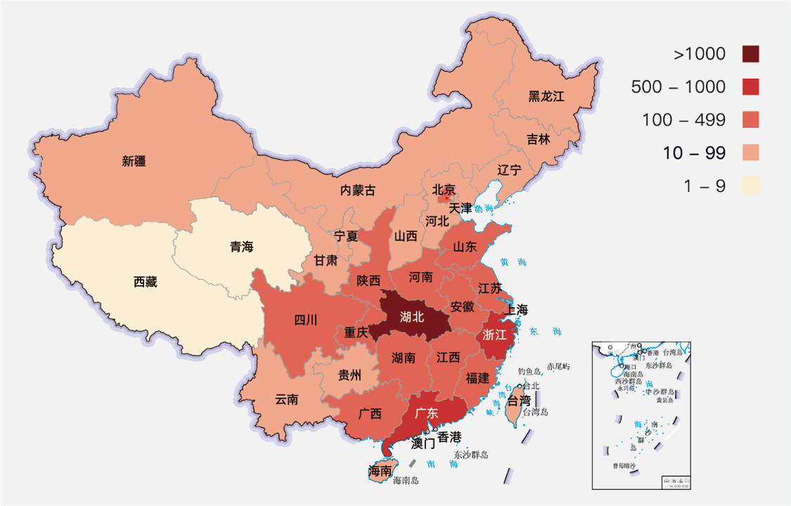
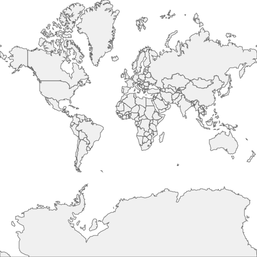
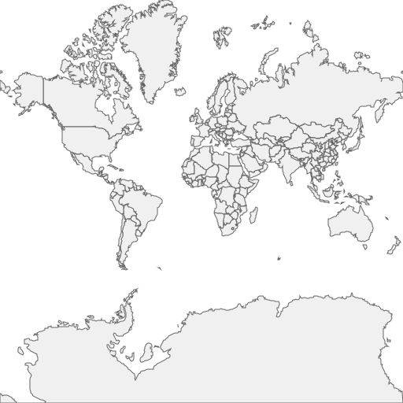
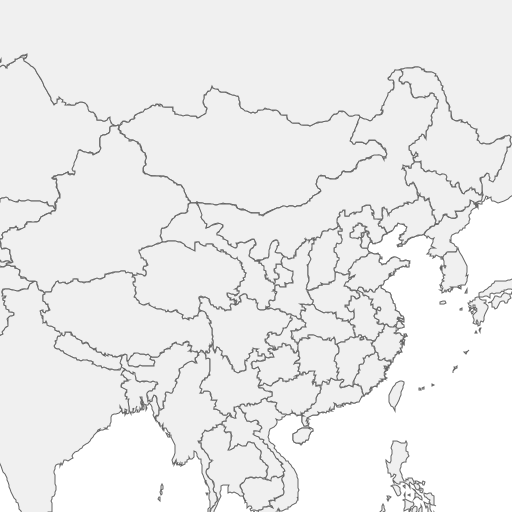
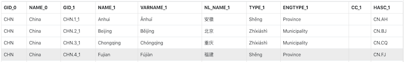
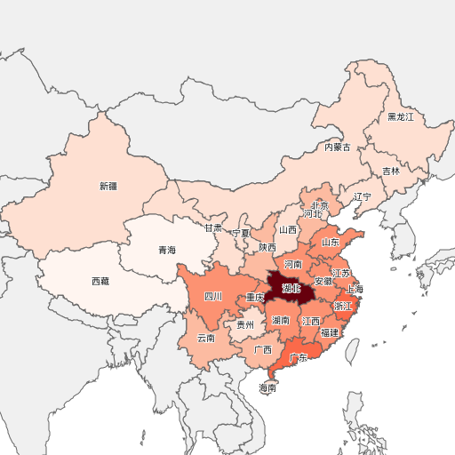

# Create a nCoV Coverage Map of China

[中文请看这里](./README-CN.md)

- [Preface](#preface)
- [Let's start with the environment](#lets-start-with-the-environment)
- [Create project, add references](#create-project-add-references)
- [GIS Data](#gis-data)
- [The rest becomes simple](#the-rest-becomes-simple)
    - [Overlays world data](#overlays-world-data)
    - [Overlays China Data](#overlays-china-data)
    - [Adjust the Viewport](#adjust-the-viewport)
    - [Connect Dynamic Data](#connect-dynamic-data)
    - [Styling the Map](#styling-the-map)
- [Summary](#summary)


## Preface
The beginning of 2020 is full of unfortunate news. The spread of new pneumonia - nCoV, Kobe's gone ... It hurts me all the time. In order not to disturb the country, I stayed at home for a few days in the new year. From time to time, pick up your phone and observe the spread of the disease. The following map is a typical GIS application that helps me to know the situation.



Whenever I see this static picture, I want to know a few more information that I don't know.
1. We can compare the range of confirmed patients in a province by color and legend. But we cannot recognize the specific number of patients in a province on this picture.
1. Due to a static map, we cannot get city-level information. If the map can be dragged, zooming in and out, it will be much convenient.
1. Every time I see red, I feel anxious. Can it be changed to other colors, I am more acceptable.

Based on these two small functions, I am going to introduce how to make a map from 0, step by step. I am planning to do it in two phases.
1. Generate a static picture with the most concise code first. Through this phase, let's get to know the API of `Ginkgoch` map development.
1. After we learned the `API` for` Ginkgoch` map development, we transformed this program into a map service, and let it work with the well-known map front-end library `Leaflet` to build an interactive map and so on.

In this article, I will kick-off with building a command-line tool to generate a static map image like I pasted above.

> [`Ginkgoch` mapping development kit](https://ginkgoch.com) is a GIS full stack development kit. You can develop map-related command line programs, map desktop programs, and map services with only one programming language - JavaScript.

## Let's start with the environment
**Previously developed map application software**, you may need to master a lot of programming language to be competent for a complete project. For example, a typical GIS B/S application generally uses Java, C# or other back-end programming languages to develop the back-end, and then uses JavaScript + HTML to develop the front-end presentation.

Today we gonna use `Ginkgoch` to develop, we no longer need to know other programming languages, instead JavaScript is the only required skill; even front-end developers can develop back-end map applications. For a minimalist development environment, we only need 2 tools.[Node.js](https://nodejs.org) (version 8 or above) [vscode](https://code.visualstudio.com/).

> This article takes care of novices and writes a lot basic content. Please ignore the content that you already familiar with.

## Create project, add references
Next, we create a project directory. Just use the following command. (I personally prefer to use the command line, because I usually use macOS for daily use of machines. So the following command lines are performed by macOS for verification).

```bash
# create work folder
cd [your workspace]
md nCoV-map
cd nCoV-map

# create project and add references
npm init -y
npm i --save ginkgoch-map canvas lodash

# create a new js file for code entry
touch tutorial-01.js
```

> The `canvas` library is referenced here because Node.js does not provide a drawing API, we can only reference a third-party` Node.js` library instead.

Till now, our project has been established.

## GIS Data
The data in GIS applications is very important. I divided it into static  and dynamic data. Static data is our geometry and their specific feature data. Such as the name of the area. Dynamic data is the epidemic situation that we are following in real time.

Generally **static data** is easier to find. Searching in google with China map data csv, json, shapefile will list you lots of result. In this project, I am going to use shapefile as my static data. [Here] (https://github.com/ginkgoch/nCoV-map/tree/develop/data) You can find the following data, which we will use later. After downloading, put them under the `data` directory of the project.

- chn/
    - gadm36_CHN_1_3857.shp - province level data
    - gadm36_CHN_2_3857.shp - city level data
- cntry02.shp - world level data

**Dynamic data** will be a bit more difficult to get. I wrote a crawler to crawled regularly. If you are interesting in it, we can chat privately. But as an example, I put a few copies of the outbreak data in the `data/infected` directory for example.

## The rest becomes simple

### Overlays world data
First, we define a function to create a map layer, a shapefile is a data layer, and multiple data layers are superimposed to form our desired map. With `ginkgoch-map`, we define a layer like this.

```javascript
function createLayerWithDefaultStyle(filePath) {
    // create a source with the specified shapefile file path
    let source = new GK.ShapefileFeatureSource(path.resolve(__dirname, filePath));

    // wrap the source as a world layer
    let layer = new GK.FeatureLayer(source);

    // set a style on the layer
    layer.styles.push(new GK.FillStyle('#f0f0f0', '#636363', 1));

    return layer;
}
```

After we got `layer`, we can peek how the layer forms and we can take a thumbnail of `cntry02.shp` with following code:
```
let worldLayer = createLayerWithDefaultStyle('../data/cntry02.shp');
await worldLayer.open();
let worldImage = await worldLayer.thumbnail(512, 512);
fs.writeFileSync(path.resolve(__dirname, './images/tutorial-01-world.png'), worldImage.toBuffer());
```

Then we execute the command below, it will output an image of the layer.
```bash
node tutorial-01.js
```



### Overlays China Data

Definitely, this is not final result, we need to superimpose the province data for more detail. Let's move on.

```javascript
const [imageWidth, imageHeight] = [512, 512];

// create a world layer with cntry02.shp
let worldLayer = createLayerWithDefaultStyle('../data/cntry02.shp');

// create a province layer with gadm36_CHN_1_3857.shp
let provinceLayer = createLayerWithDefaultStyle('../data/chn/gadm36_CHN_1_3857.shp');

let mapEngine = new GK.MapEngine(imageWidth, imageHeight);
mapEngine.srs = new GK.Srs('EPSG:900913');
mapEngine.pushLayer(worldLayer);
mapEngine.pushLayer(provinceLayer);

let image = await mapEngine.image();
fs.writeFileSync(path.resolve(__dirname, './images/tutorial-01-default.png'), image.toBuffer());
```

Let's open picture `tutorial-01-default.png`, check that the province of China are overlaps on the world map.



### Adjust the Viewport

Oh? Too small ~ OK, let's adjust the viewport of the map.

```javascript
await provinceLayer.open();
let chinaEnvelope = await provinceLayer.envelope();
chinaEnvelope = GK.ViewportUtils.adjustEnvelopeToMatchScreenSize(chinaEnvelope, imageWidth, imageHeight);

let image = await mapEngine.image(chinaEnvelope);
fs.writeFileSync(path.resolve(__dirname, './images/tutorial-01-china.png'), image.toBuffer());
```



### Connect Dynamic Data

We rendered the static data, while drawing borders for provinces of China. Next, we will connect dynamic infection data to map. How do we do it?

First, let's look at the attributed data of static data. Shapefile feature data is stored in * .dbf files. You can choose to open the dbf file with your favorite tools. I personally use the `shapefile viewer` to check it out. Refer to [this project for the tool](https://github.com/ginkgoch/node-shapefile-viewer).



`NL_NAME_1` is the name of the province we need, and then we take a look at a snippet of dynamic data.

```json
[
    {
        "provinceName": "湖北省",
        "provinceShortName": "湖北",
        "confirmedCount": 4586,
        "suspectedCount": 0,
        "curedCount": 90,
        "deadCount": 162,
        "comment": "待明确地区：治愈 30",
        "cities": [
            {
                "cityName": "武汉",
                "confirmedCount": 2261,
                "suspectedCount": 0,
                "curedCount": 54,
                "deadCount": 129
            },
            {
                "cityName": "黄冈",
                "confirmedCount": 496,
                "suspectedCount": 0,
                "curedCount": 5,
                "deadCount": 12
            },
            ...
```

Interestingly, the dynamic data also includes the province name `provinceShortName`; and the number of infections, suspects, cures, and deaths. Now, all we have to do is associate the static data with `NL_NAME_1` and dynamic data with` provinceShortName`. This is built-in function in `ginkgoch-map`.

First, we define a function to help us define a relationship.
```javascript
/**
 * field - the dynamic field value to return.
 * infectedData - the infected data in JSON format.
 */
function _getDynamicFieldForProvince(field, infectedData) {
    return {
        name: field, fieldsDependOn: ['NL_NAME_1'], mapper: feature => {
            const fullName = feature.properties.get('NL_NAME_1');
            const infectionInfo = _.find(infectedData, d => {
                return fullName.includes(d.provinceShortName);
            });

            if (infectionInfo === undefined) {
                return undefined;
            } else {
                return infectionInfo[field];
            }
        }
    };
}
```

Then build a mapping function for the 4 columns.
```javascript
function connectDynamicData(layer) {
    // load dynamic data
    let dynamicData = fs.readFileSync(path.resolve(__dirname, '../data/infected/1580376765333.json')).toString();
    dynamicData = JSON.parse(dynamicData);
    
    // connect 4 dynamic attribute fields to the source.
    const source = layer.source;
    source.dynamicFields.push(_getDynamicFieldForProvince('confirmedCount', dynamicData));
    source.dynamicFields.push(_getDynamicFieldForProvince('suspectedCount', dynamicData));
    source.dynamicFields.push(_getDynamicFieldForProvince('curedCount', dynamicData));
    source.dynamicFields.push(_getDynamicFieldForProvince('deadCount', dynamicData));
}
```

Finally, we call this function for mapping.
```javascript
//...omit the surrounded code
let provinceLayer = createLayerWithDefaultStyle('../data/chn/gadm36_CHN_1_3857.shp');
connectDynamicData(provinceLayer);
```

At this point, we can assume that `provinceLayer` already contains dynamic data. It will dynamically load the mapping relationship to find the required data when necessary.

### Styling the Map
We are moving into the last step: Styling the map. We break down the number of infected people into several levels, and render different colors according to the levels to indicate the severity. Better yet, `ginkgoch-map` provides a corresponding API for rendering.

We first define a function to create a styled object `Style`.

```javascript
function _getClassBreakStyle(field) {
    const strokeColor = '#636363';
    const strokeWidth = 1;

    let countStops = [1, 10, 50, 100, 300, 500, 750, 1000, Number.MAX_SAFE_INTEGER];
    let activePallette = ['#fff5f0', '#fee0d2', '#fcbba1', '#fc9272', '#fb6a4a', '#ef3b2c', '#cb181d', '#67000d']
    let style = new GK.ClassBreakStyle(field);

    for (let i = 1; i < countStops.length; i++) {
        style.classBreaks.push({ minimum: countStops[i - 1], maximum: countStops[i], style: new GK.FillStyle(activePallette[i - 1], strokeColor, strokeWidth) });
    }

    return style;
}
```

Then apply it to the `layer`, and it works.

```javascript
let confirmedCountStyle = _getClassBreakStyle('confirmedCount');
provinceLayer.styles.push(confirmedCountStyle);

// we also add the text style for labeling
let provinceLabelStyle = new GK.TextStyle('[NL_NAME_1]', 'black', 'Arial 12px');
provinceLabelStyle.lineWidth = 2;
provinceLabelStyle.strokeStyle = 'white';
provinceLabelStyle.location = 'interior';
provinceLayer.styles.push(provinceLabelStyle);
```



Isn't it interesting? We are now free to replace the color palette and make it blue. Just replace this code.
```javascript
// let activePallette = ['#fff5f0', '#fee0d2', '#fcbba1', '#fc9272', '#fb6a4a', '#ef3b2c', '#cb181d', '#67000d'];
let activePallette = ['#f7fbff', '#deebf7', '#c6dbef', '#9ecae1', '#6baed6', '#4292c6', '#2171b5', '#08519c'];
```


## Summary
You could find all the code implementation at: https://github.com/ginkgoch/nCoV-map/tree/develop/tutorials

Looks like a lot work to do, most of the code is business code, and style settings. It's quite simple to understand. That's it for today. When I have time later, I will write another article to migrate this code to a map service as well as an interactive map application for browser. Feel free to contact me by [ginkgoch@outlook.com](mailto:ginkgoch@outlook.com) or leave me message at my website [ginkgoch.com](https://ginkgoch.com).

Happy Mapping!