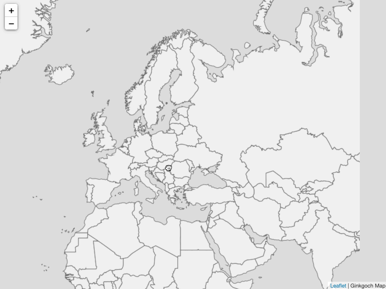

# MAP Server Project Template
This is a project template to setup the baseline project of a map server application.

## What it includes
This project baseline includes:
1. Necessary dependencies including server and client are installed. Refer to `package.json` for details.
1. A server router with KOA service framework for serving an XYZ map tile server with a world shapefile.
1. A client HTML page with `Leaflet` to display the first world map.

Here is a short video.

## How to use it?
The easiest way to start this project is to clone this project as the baseline of your map server project. Once it is cloned, follow the following steps to make it as your own project.
1. Customize the `package.json` file to your own specific project information. 
1. `npm install` to restore all the dependencies.
1. `npm start` to start server.
1. Open browser and type `http://localhost:3000`, an interactive world map will represent in front of you.

## Project layout
- client (includes all the client html pages and dependencies)
    - assets
        - leaflet
        - axios
    - index.html
- controllers (includes all the map related logic)
- data (includes all GIS data)
- routes (includes the KOA routes)
- index.js (the main entry of the server)

Happy Mapping!
